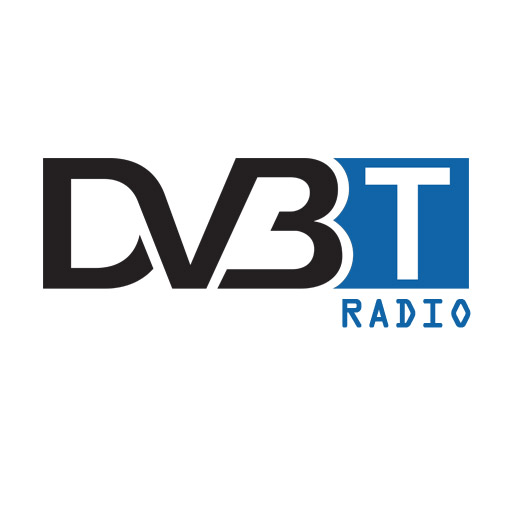

# HackRF DVB Radio

<p align="center"></p>

[English](README.md) · **Italiano**

Applicazione Windows per creare e trasmettere con HackRF One un multiplex DVB-T contenente esclusivamente servizi radio. Ogni sorgente audio diventa un servizio DVB distinto, con nome e numero logico LCN configurabili.

La versione verificata è la **0.2.11**. Il profilo RF predefinito è 474 MHz, 8 MHz, 8K, 16-QAM, FEC 1/2 e intervallo di guardia 1/4. Sono selezionabili anche banda 5/6/7/8 MHz, modalità 2K/8K, QPSK/16-QAM/64-QAM, FEC e intervallo di guardia, con ricalcolo automatico della capacità. L'indicatore distingue il bitrate DVB-T teorico dal limite stabile della pipeline live, fissato al 70%, e impedisce l'avvio quando la configurazione supera tale soglia pratica.

## Funzioni

- Numero dinamico di servizi radio.
- Ingressi HTTP, HTTPS, Icecast, Shoutcast, HLS e file locali tramite FFmpeg.
- MP2 oppure AAC-LC (ADTS), bitrate configurabile, campionamento 32/44,1/48 kHz e mono/stereo.
- La modalità `AUTO` copia senza ricodifica gli ingressi MP2/AAC compatibili e converte in MP2 le altre sorgenti.
- Service ID, PMT PID e Audio PID automatici o modificabili manualmente.
- Generazione PAT, PMT, SDT e NIT, compreso il descrittore LCN EACEM effettivo.
- Nome del multiplex/rete configurabile.
- MPEG-TS CBR, modulazione DVB-T, generazione IQ e uscita diretta su HackRF.
- Interfaccia scura con indicatore segmentato della capacità del multiplex.
- Controllo dell'amplificatore RF e del guadagno TX VGA da 0 a 47 dB.
- Riconnessione automatica degli stream online.

L'architettura è predisposta per un futuro singolo servizio TV, ma in questa versione il video non è implementato.

## Avvio rapido

1. Scaricare ed eseguire `HackRF-DVB-Radio-Setup-0.2.11.exe` dalla release GitHub.
2. Tenere disponibile una connessione Internet mentre il setup installa FFmpeg, TSDuck e Radioconda (GNU Radio, gr-dtv e SoapyHackRF).
3. Collegare HackRF One e avviare l'applicazione.
4. Fare doppio clic sulle celle delle stazioni per modificare nome, LCN, sorgente e identificativi.
5. Collegare l'uscita RF con un'attenuazione adeguata e premere **Avvia trasmissione RF**.

Le sorgenti integrate `sine=frequency=1000` e `sine=frequency=1500` consentono una prova immediata con due servizi. La trasmissione RF non parte mai automaticamente.

## Compilazione su Windows

Installare Radioconda ed eseguire:

```powershell
.\build_windows.ps1
```

Lo script compila l'applicazione con PyInstaller e crea il setup Windows con Inno Setup. Il logo fornito è in `assets/app.png`; l'icona Windows è `assets/app.ico`.

## Sicurezza RF e normativa

Trasmettere esclusivamente su frequenze e livelli consentiti dalla normativa locale. Per le prove da banco usare un collegamento schermato e un'attenuazione adeguata. Non collegare mai direttamente l'uscita HackRF all'ingresso di un televisore o ricevitore senza attenuatore.
